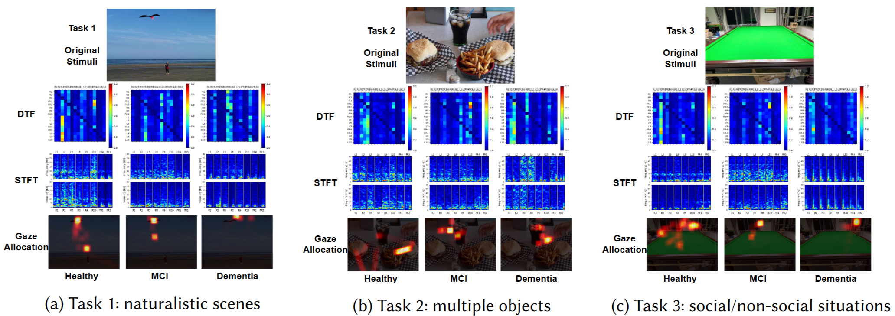
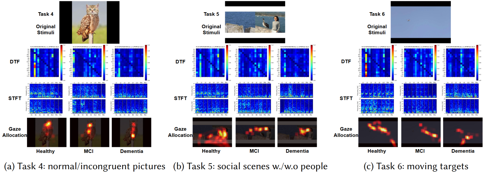
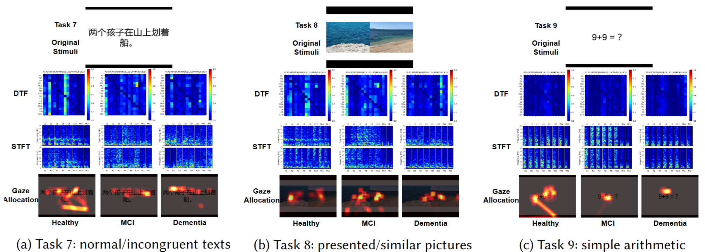

# The EasyCog Dataset: Easier Cognitive Assessment With Passive Video Watching


## Overview 
As the global population ages, the prevalence of cognitive impairment, including dementia, continues to rise, highlighting the urgent need for effective early detection and assessment tools. Current gold standard assessments, such as the Montreal Cognitive Assessment (MoCA) and the Mini-Mental State Examination (MMSE), are often hindered by subjectivity, significant user burden, and practice effect, limiting their applicability. In light of these challenges, we observe that passive visual stimuli can effectively engage cognitive domains while minimizing the need for active participation. Leveraging this observation, we establish EasyCog, a novel multi-modal dataset designed to support low-burden, cost-effective cognitive assessments. EasyCog captures brain and behavioral responses using lightweight, easy-to-wear sensors while participants passively watch a structured cognitive video. The dataset includes EEG signals, eye-tracking data, and clinical scores (MoCA/MMSE) from 69 participants, including healthy controls and individuals diagnosed with various types of dementia, across diverse settings. To benchmark the dataset, we propose CogAssess, a two-stage learning framework that jointly optimizes neural decoding and cognitive score prediction. We also evaluate multiple baseline models and conduct comprehensive ablation studies. The benchmark methods can achieve a low mean absolute error of 4.466 and 3.524 for MoCA and MMSE compared with clinical professionals' assessments for the unseen subjects. The results demonstrate that EasyCog supports accurate and objective cognitive assessment without the need for active task execution. By integrating passive visual stimuli with affordable physiological sensing, our publicly available EasyCog dataset provides a foundation for future research in accessible and scalable cognitive monitoring across both clinical and community settings.

## EEG and eye movement pattern example




## Installation
Please follow instructions mentioned in the [INSTALL.md](/INSTALL.md) file.

## Download

The full dataset can be downloaded [here](https://drive.google.com/drive/folders/1uiZcIXwdTst5BlTIGzHXc3n8uUjsXBKM?usp=sharing).


The folder has the following items:
- **unsliced** folder: Raw data.
- **sliced** folder: Preprocessed data.
- **video_task_v20241102.mp4**: Designed video stimuli.
- **Patient_info_dataset.xlsx**: Patient information.


## Run Scripts
First, generate the statistics features by running the 
`data_preocessing/process.py`, making sure that the following path and mode are set correctly
```
MODE = 'Feat_Generation'    # 'Feat_Generation', 'Feat_Generation_3min', 'Raw_processing'
patient_info_xlsx = 'path/to/Patient_Info_dataset.xlsx'
feat_folder = f'path/to/dataset'
feat_name = 'asreog_filter_order3_all_data'
```

Then generate the json file by running the `orgnize_dataset.py`, making sure the following path are set correctly
```
feat_name = 'asreog_filter_order3_all_data'

folder_path = f'./sliced/{feat_name}'
saved_json_folder = f'./data_json_files/'
feature_folder_path = f'./processed_feat/{feat_name}'
patient_info_path = './Patient_Info_dataset.xlsx'
```

After that, run the codes


## Run Data Validation Script
You can run the ploting script that produces the data validation figures in our paper.

Enter the directory `datacheck/` and run code files `plot_task_difference.py`, making sure you have downloaded our dataset and set the following path correctly
```
video_path = f'path/to/video.mp4'
features_folder = 'dataset_path/sliced'
feat_name = 'asreog_filter_order3_all_data'
sliced_path = f'{features_folder}/{feat_name}'
save_path = 'path/to/save/figs'
```
Wait for few seconds and you will find the imgae will be saved in your specified `save_path`.
For your reference, the produced figs have been saved in the `data_check/figs`


## Further Testing and Customization
### 1. Data Preprocessing
#### 1.1 Data Preprocessing and Slicing
In `data_processing/process.py`, we include several mode for further testing

By setting `MODE = 'Feat_Generation'`, the code will generate the statistics feature with the processed and sliced data in our dataset. 

By setting `MODE = 'Feat_Generation_3min'`, the code will generate the 3-min features with the processed data in our dataset.

By setting `MODE = 'Raw_processing' `, the code will process and slice the raw data. Please prepare the raw data or modify the `read_subject()` function in `data_processing/process_utils.py`. The example file structure for each subject is:
```
- 001_subject
--- 2025_01_01_00_00_00
----- video_task
------- exg_data.npz
------- eye_tracking_record.txt
------- recorded_video_frame_timestamps.txt
------- timestamps.npz

--- 2025_01_01_00_08_00
----- resting_task
------- exg_data.npz
------- eye_tracking_record.txt
------- recorded_video_frame_timestamps.txt
------- timestamps.npz
```

#### 1.2 Dataset Json Generation
By running the `orgnize_dataset.py`, you can generate the json file for loading the dataset, besides the default procedure, you can further use some extra functions as follows to combine two json files, delete some specific subject, or check the correctness of the json file.
```
combine_json_files(saved_json_file, saved_json_file2, saved_json_file3)
delete_given_subject_from_json(saved_json_file, ['010_patient'], saved_json_file)
check_key_order(saved_json_file)
```


### 2. Deep Learning Pipeline

#### 2.1 Prepare the config yaml file
See the `DL_pipeline/configs folder`. Take `BL_D/cfg_CBraMod_Direct_Finetune_Resting.yml` as example:
modify the data_folder and trials_json as yours
```
sliced_data_folder_all: /path/to/your/data/folder
sliced_trials_json_all: /path/to/your/data/json
```


#### 2.2 Prepare the 10-fold cross-validation script
See the `run_cross_validation.sh`. Modify the `cfg_file` (for the picture-layer feature extraction) and the `cfg_file_reg` (for the task-layer and subject-layer score regression) as your config files.
```
cfg_file='CogAssess_v3/cfg_mocov2_sample_joint_train_classifier_mask_pretrain_CBraMod.yml'
cfg_file_reg='CogAssess_v3/cfg_mocov2_sample_joint_train_regressor_mask_pretrain_RegTransformer.yml'
log_folder="../EasyCog/logs/CogAssess_v3/"
```

#### 2.3 How to modify the model
See `DL_pipeline/models` folder.


#### 2.4 Run the test script
See `run_cross_validation_eval_load_log.sh`. It analyses the outputs recorded in the log files. So we do not need to perform inference to get the results. You need to replace the `log_folder` and `log_filename_prefix` with your target paths.


